# MVP — Pipeline de dados em nuvem: produção industrial × juros, câmbio e inflação

**Universidade de Brasília — Departamento de Engenharia de Produção · Seminários (SSD/MVP)**  
Aluno: Lucas Iwano · Professor: André Luiz Marques Serrano

> Repositório: https://github.com/iwanolucas/MVP-Industria-Juros  
> Relatório em Word: `Relatorio_MVP_Industria_Juros_Lucas_Iwano.docx`

## Como reproduzir (resumo)

```bash
pip install -r requirements.txt
python scripts/coleta.py && python scripts/etl.py && python scripts/analise.py
```

No Databricks: crie uma *Git folder* com este repositório e execute `notebooks/01`, `02` e `03` em ordem.


## 1. Objetivo


### 1.1 Problema

O juro real brasileiro está em nível elevado (9,3% a.a. em agosto/2026, pelos dados deste trabalho). Um gestor industrial, um banco de desenvolvimento ou um investidor que precise decidir onde expandir capacidade, provisionar risco ou renegociar prazos depara-se com duas perguntas: (i) a indústria brasileira se recuperou de fato do choque de 2020, ou a média esconde setores em depressão? e (ii) o quanto os juros e o câmbio explicam o ritmo de produção de cada setor, de modo que um corte de juros pudesse orientar a priorização de setores?

O MVP constrói um pipeline de dados na nuvem que integra duas fontes públicas distintas, a Pesquisa Industrial Mensal – Produção Física (PIM-PF/IBGE), com 27 atividades industriais, e as séries macroeconômicas do Banco Central (Selic, IPCA e dólar), e usa o resultado para testar hipóteses explícitas sobre a relação entre política monetária, câmbio e produção industrial setorial.

O objetivo foi definido antes da busca e da análise dos dados. A base foi escolhida depois, por ser aberta, agregada (sem dados pessoais) e capaz de responder às perguntas abaixo.


### 1.2 Hipóteses

- H1 — Juros. Juro real alto reduz o crescimento da produção industrial, com defasagem de alguns meses, e o efeito é mais forte em setores de bens de capital e de consumo durável, dependentes de crédito.
- H2 — Câmbio. A desvalorização do real está associada a maior produção nos setores exportadores e de substituição de importações, depois de controlado o efeito dos juros.
- H3 — Heterogeneidade. A recuperação pós-pandemia foi desigual: o agregado voltou ao nível de 2019, mas há divisões industriais que ainda estão abaixo dele.


### 1.3 Perguntas de negócio

| # | Pergunta | Decisão a que se liga |
|---|---|---|
| P1 | Quais atividades industriais ainda estão abaixo do nível de produção de 2019 e quais o superaram? Em quantos meses cada uma voltou ao patamar pré-pandemia? | Onde há capacidade ociosa estrutural e onde há demanda aquecida. |
| P2 | Quais atividades têm crescimento anual mais sensível ao juro real e com que defasagem (0 a 12 meses)? A relação é estatisticamente distinguível do acaso? | Quando esperar o efeito de uma mudança da Selic e em que setores. |
| P3 | Depois de controlar o juro real, a variação cambial de 12 meses está associada à produção de cada atividade? Em quais? | Exposição cambial (insumos importados vs. competitividade). |
| P4 | Quais atividades têm maior volatilidade do crescimento anual e quão maior é o risco relativo entre elas? | Provisão de risco e dimensionamento de capital de giro. |
| P5 | Se o juro real caísse 3 p.p. (da faixa atual de 9,3% a.a. para perto da média histórica de 5,5%), qual variação de crescimento anual o modelo projeta para a indústria e para cada divisão, e com que incerteza? | Priorização de setores em um cenário de flexibilização monetária. |

Nenhuma pergunta foi removida ao final: as que não puderam ser respondidas de forma conclusiva estão discutidas na Seção 5.6 e na Autoavaliação.


## 2. Coleta


### 2.1 Fontes

| Arquivo bruto | Origem | Registros | Tamanho | Formato original |
|---|---|---|---|---|
| pimpf_8888.json | apisidra.ibge.gov.br/values/t/8888/n1/all/v/12606/p/all/c544/all/f/n | 7.966 | 1.612 KB | JSON |
| sgs_4189_selic_anualizada.json | api.bcb.gov.br/dados/serie/bcdata.sgs.4189/dados?formato=json&dataInic… | 297 | 12 KB | JSON |
| sgs_433_ipca_mensal.json | api.bcb.gov.br/dados/serie/bcdata.sgs.433/dados?formato=json&dataInici… | 296 | 12 KB | JSON |
| sgs_13522_ipca_12m.json | api.bcb.gov.br/dados/serie/bcdata.sgs.13522/dados?formato=json&dataIni… | 296 | 12 KB | JSON |
| sgs_3698_dolar_medio.json | api.bcb.gov.br/dados/serie/bcdata.sgs.3698/dados?formato=json&dataInic… | 296 | 12 KB | JSON |

Coleta realizada em 28/09/2026 (UTC) pelo script scripts/coleta.py, que grava também data/raw/_manifesto_coleta.json com URL, data, volume, formato e hash SHA-256 de cada arquivo. As APIs são públicas e não exigem chave. O script repete a requisição até 5 vezes, porque a API do BCB devolveu corpo vazio de forma intermitente durante o desenvolvimento.

Não houve web scraping: as duas fontes oferecem API oficial. A tabela 8888 da SIDRA traz o número-índice de produção física com base 2022 = 100, sem ajuste sazonal, para o Brasil, de janeiro/2002 a julho/2026 (295 meses × 27 atividades). As quatro séries do SGS são mensais: Selic acumulada no mês anualizada (4189), IPCA mensal (433), IPCA acumulado em 12 meses (13522) e dólar médio de venda (3698).


### 2.2 Persistência na nuvem

Os dados brutos foram persistidos em um Volume do Unity Catalog (workspace.industria_juros.raw) no Databricks Free Edition e, após o ETL, em quatro tabelas Delta no mesmo esquema (Seção 4.3). O ambiente Free Edition não tem acesso à internet: a chamada às APIs falhou por erro de resolução de DNS. O notebook 01 trata esse caso copiando o bronze versionado no repositório (data/raw), que foi coletado pelo mesmo script coleta.py em 28/09/2026, e o manifesto de coleta (com hash SHA-256) foi gravado junto.


## 3. Modelagem


### 3.1 Modelo de dados

Adotou-se um esquema dimensional do tipo constelação de fatos, com duas tabelas fato que compartilham a dimensão tempo:

- fato_producao: uma linha por mês e atividade (7.965 linhas): índice de produção, variação anual e indicador de ausência.
- fato_macro: uma linha por mês (297 linhas): Selic, IPCA, dólar e as métricas derivadas (juro real e variação cambial de 12 meses).
- dim_tempo: 297 meses, de janeiro/2002 a setembro/2026, com ano, trimestre e marcador de pandemia.
- dim_atividade: 27 atividades com código CNAE, nível hierárquico (geral, seção, divisão) e nome abreviado.

A escolha se justifica por três razões. As duas fontes têm o mesmo grão temporal (mês), o que torna o tempo a dimensão natural de integração. As métricas macro pertencem ao mês, não à atividade, e repeti-las em cada linha de produção multiplicaria por 27 o volume e o risco de inconsistência. Por fim, o esquema permite responder às perguntas com joins simples de SQL.

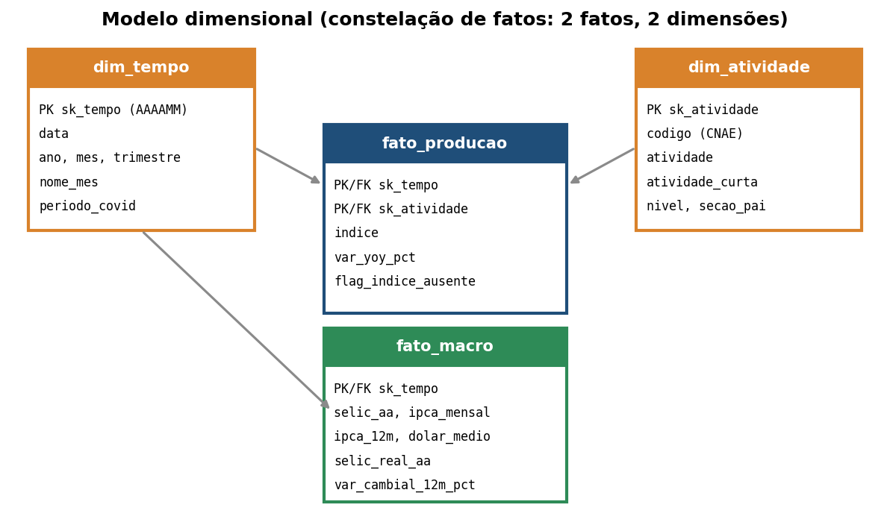

*Modelo dimensional do MVP (catalogo/diagrama_estrela.png).*


### 3.2 Catálogo de dados

Os domínios abaixo foram lidos da própria base carregada, não declarados de memória. O catálogo completo, com descrição e linhagem de cada atributo, está em catalogo/catalogo_dados.md e .csv.

| Tabela | Atributo | Tipo | Domínio observado | Nulos | Linhagem (resumo) |
|---|---|---|---|---|---|
| dim_tempo | sk_tempo | inteiro (chave) | 200201 a 202609 | 0 | Gerada no ETL a partir do mês da fonte (R1). |
| dim_tempo | data | data | 2002-01-01 a 2026-09-01 | 0 | Mês em português da SIDRA / data dd/mm/aaaa do SGS -> 1º dia do mês (R1, R4). |
| dim_tempo | ano | inteiro | 2002 a 2026 | 0 | Derivado de data. |
| dim_tempo | mes | inteiro | 1 a 12 | 0 | Derivado de data. |
| dim_tempo | trimestre | inteiro | 1 a 4 | 0 | Derivado de data. |
| dim_tempo | nome_mes | categórico | 12 categorias (ex.: Apr, Aug, Dec, Feb, …) | 0 | Derivado de data. |
| dim_tempo | periodo_covid | booleano (0/1) | 0 a 1 | 0 | Regra fixa do ETL. |
| dim_atividade | sk_atividade | inteiro (chave) | 1 a 27 | 0 | Sequência gerada no ETL. |
| dim_atividade | codigo | categórico (texto) | 27 categorias (ex.: 1, 2, 3, 3.10, …) | 0 | Extraído do rótulo da atividade (R2). IBGE/SIDRA tabela 8888 (PIM-PF), variável 12606, coletada em 28/09/2026. |
| dim_atividade | atividade | texto | texto livre (27 valores distintos) | 0 | Extraído do rótulo (R2). IBGE/SIDRA tabela 8888 (PIM-PF), variável 12606, coletada em 28/09/2026. |
| dim_atividade | atividade_curta | texto | texto livre (27 valores distintos) | 0 | Derivado de atividade. |
| dim_atividade | nivel | categórico | divisao, geral, secao | 0 | Derivado do código. |
| dim_atividade | secao_pai | categórico | 3 | 3 | Derivado do código. |
| fato_producao | sk_tempo | inteiro (FK) | 200201 a 202607 | 0 | FK para dim_tempo. |
| fato_producao | sk_atividade | inteiro (FK) | 1 a 27 | 0 | FK para dim_atividade. |
| fato_producao | indice | numérico | 9.39 a 316.93 | 240 | IBGE/SIDRA tabela 8888 (PIM-PF), variável 12606, coletada em 28/09/2026. '-' convertido em NULL (R3). |
| fato_producao | var_yoy_pct | numérico (%) | -92.11 a 938.77 | 564 | Calculada no ETL (R6). |
| fato_producao | flag_indice_ausente | booleano (0/1) | 0 a 1 | 0 | Derivado de indice. |
| fato_macro | sk_tempo | inteiro (FK) | 200201 a 202609 | 0 | FK para dim_tempo. |
| fato_macro | selic_aa | numérico (% a.a.) | 1.90 a 26.32 | 0 | BCB/SGS série 4189, coletada em 28/09/2026. |
| fato_macro | ipca_mensal | numérico (% a.m.) | -0.68 a 3.02 | 1 | BCB/SGS série 433, coletada em 28/09/2026. |
| fato_macro | ipca_12m | numérico (%) | 1.88 a 17.24 | 1 | BCB/SGS série 13522, coletada em 28/09/2026. |
| fato_macro | dolar_medio | numérico (R$/US$) | 1.56 a 6.10 | 1 | BCB/SGS série 3698, coletada em 28/09/2026. |
| fato_macro | selic_real_aa | numérico (% a.a.) | -4.44 a 12.95 | 1 | Calculada no ETL (R7) a partir de selic_aa e ipca_12m. |
| fato_macro | var_cambial_12m_pct | numérico (%) | -26.90 a 67.45 | 13 | Calculada no ETL (R8). |
| fato_macro | flag_tem_producao | booleano (0/1) | 0 a 1 | 0 | Derivado no ETL. |

Sobre a obrigatoriedade: os únicos nulos com significado próprio são (a) o índice das divisões 3.18 (Impressão) e 3.33 (Manutenção), que o IBGE só publica a partir de 2012, (b) os 12 primeiros meses de variação anual e cambial, que dependem de um ano de histórico, e (c) os campos do mês corrente do BCB (setembro/2026), ainda sem divulgação completa. Nenhum nulo foi imputado.


## 4. Carga (ETL)


### 4.1 Arquitetura do pipeline

O pipeline segue a arquitetura em camadas (medallion) e é executado por três notebooks Databricks, cada um um invólucro fino sobre um script Python versionado. O mesmo código roda localmente (SQLite) e na nuvem (tabelas Delta), o que permitiu validar a lógica antes de subir à plataforma.

| Camada | Conteúdo | Onde | Código |
|---|---|---|---|
| Bronze | JSON bruto das APIs, sem alteração | Volume raw (Unity Catalog) / data/raw | notebooks/01_coleta_bronze.py → scripts/coleta.py |
| Silver | Tabelas limpas e tipadas (datas, códigos, nulos) | Memória do ETL | scripts/etl.py (R1 a R6) |
| Gold | Esquema estrela em Delta | workspace.industria_juros.* | notebooks/02_etl_silver_gold.py → scripts/etl.py (R7 a R9) |
| Consumo | Consultas SQL, testes e gráficos | Notebook 03 | notebooks/03_analise.py → scripts/analise.py |


### 4.2 Regras de negócio da transformação

| Regra | Descrição | Efeito medido |
|---|---|---|
| R1 | Mês em português ("janeiro 2002") convertido em data (1º dia do mês) e chave AAAAMM. | 295 meses PIM-PF e 297 meses BCB alinhados. |
| R2 | Código CNAE separado do nome da atividade. | 27 atividades: 1 geral, 2 seções e 24 divisões. |
| R3 | "-" (sem informação) vira NULL; nunca imputado. | 240 valores nulos (2 divisões × 120 meses). |
| R4 | Datas do BCB (dd/mm/aaaa) normalizadas para o 1º dia do mês; valores em ponto flutuante. | Junção exata por mês. |
| R5 | Duplicatas pela chave natural (mês, atividade) removidas, mantendo a primeira. | 0 duplicatas. |
| R6 | Variação anual = índice ÷ índice de 12 meses antes − 1, por atividade. | 564 nulos estruturais (12 meses iniciais e ausências). |
| R7 | Juro real ex-post = (1 + Selic a.a.) ÷ (1 + IPCA 12m) − 1. | Faixa observada de −4,4% a 13,0% a.a. |
| R8 | Variação cambial 12m = dólar médio ÷ dólar médio de 12 meses antes − 1. | Positivo = real desvalorizado. |
| R9 | Meses só do BCB (sem PIM-PF) permanecem na fato_macro com flag_tem_producao = 0. | 2 meses (ago. e set./2026). |

Foram verificadas as integridades referencial (toda chave das fatos existe nas dimensões) e de unicidade (nenhuma duplicata na chave composta), com asserções no ETL: o script falha se alguma delas for violada.


### 4.3 Execução na nuvem e persistência

Execução realizada em 28/09/2026 no Databricks Free Edition (workspace da conta do aluno, compute serverless), a partir de uma Git folder ligada ao repositório público do GitHub. Os três notebooks foram executados em ordem e as capturas de tela estão referenciadas abaixo.

Notebook 01 (bronze). O ambiente Free Edition não tem saída para a internet: a primeira execução falhou ao chamar a API do IBGE com erro de resolução de DNS ("Failed to resolve 'apisidra.ibge.gov.br'"). O notebook foi então alterado para tentar a API e, em caso de falha, copiar para o Volume o bronze versionado no repositório, que foi coletado pelo script coleta.py em 28/09/2026 (manifesto com URL, volume e SHA-256). Portanto, a coleta a partir das APIs ocorreu na máquina local, e a persistência na nuvem parte do arquivo bruto. A Figura 7 mostra os seis arquivos no Volume workspace.industria_juros.raw (o JSON da PIM-PF tem 1.650.738 bytes, igual ao manifesto).

Notebook 02 (silver e gold). O ETL rodou dentro do Databricks e gravou as quatro tabelas Delta em workspace.industria_juros. As contagens de linhas são idênticas às da execução local: dim_tempo 297, dim_atividade 27, fato_producao 7.965 e fato_macro 297 (Figura 8). O DESCRIBE HISTORY da fato_producao mostra a versão 0 criada por CREATE OR REPLACE TABLE AS SELECT, em 28/09/2026, pelo usuário da conta, o que comprova a persistência (Figura 9).

Notebook 03 (análise). As consultas SQL sobre as tabelas Delta reproduzem os resultados locais: a completude do índice (Figura 10) mostra 120 meses ausentes em 3.18 e 3.33; o P1 em SQL (Figura 11) dá −33,1% para Impressão e −27,0% para Confecção, iguais aos do pandas; o P4 em Spark SQL (Figura 12) dá desvios de 19,6, 17,0, 16,9 e 16,7 p.p. para Fumo, Informática, Veículos e Impressão. A execução de scripts/analise.py sobre as tabelas Delta reproduziu o teste de permutação do P2 (Figura 13): 2.000 permutações, 0 de 27 séries significativas, 11 correlações negativas, e Produtos químicos com r = −0,211, defasagem de 2 meses e p = 0,209, valores idênticos aos da execução local (semente 42).

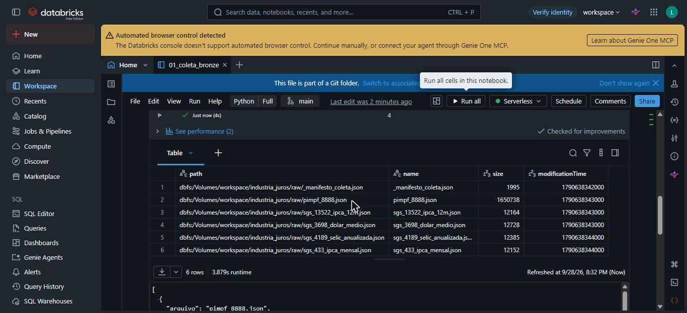

*Figura 7 — Notebook 01: arquivos brutos no Volume workspace.industria_juros.raw.*

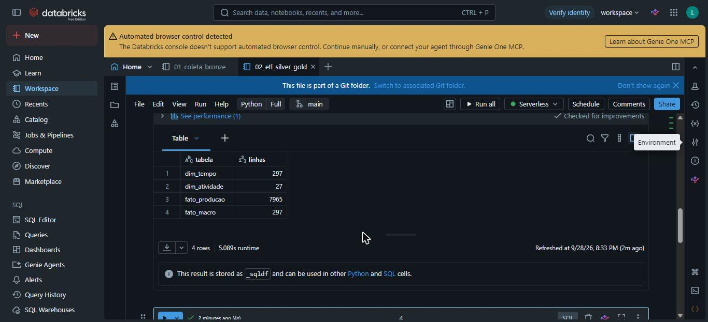

*Figura 8 — Notebook 02: contagem das quatro tabelas Delta após a carga.*

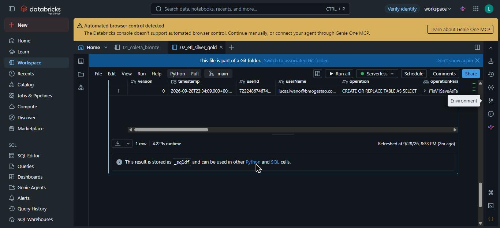

*Figura 9 — Notebook 02: DESCRIBE HISTORY da fato_producao (persistência Delta).*

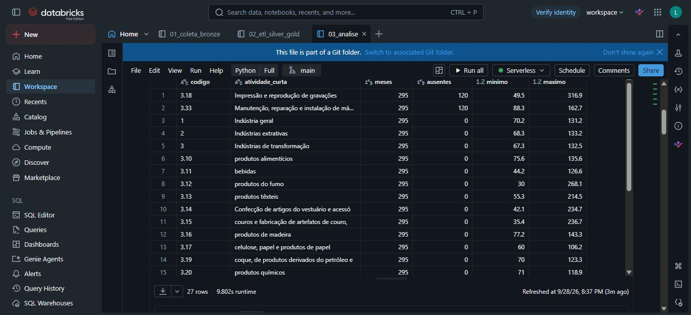

*Figura 10 — Notebook 03: qualidade do índice por atividade, em SQL sobre o Delta.*

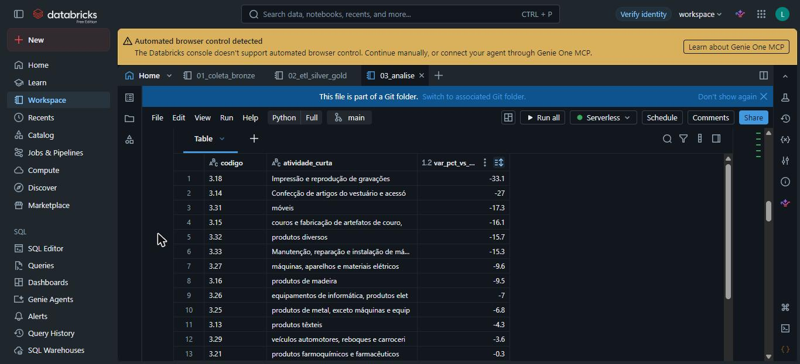

*Figura 11 — Notebook 03: P1 em SQL (variação vs. média de 2019).*

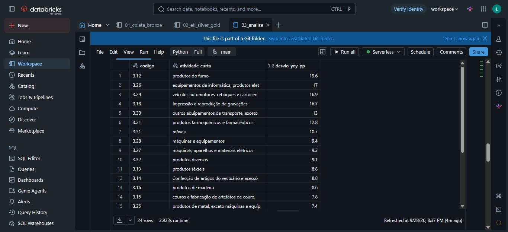

*Figura 12 — Notebook 03: P4 em SQL (desvio-padrão do crescimento anual).*

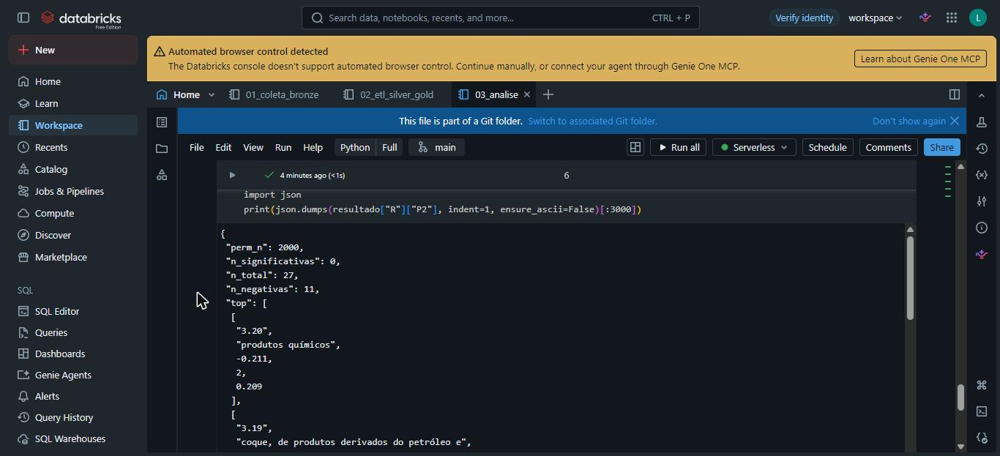

*Figura 13 — Notebook 03: saída do P2 executado sobre as tabelas Delta.*


## 5. Análise


### 5.1 Qualidade dos dados

Todos os atributos foram verificados nas seis dimensões usuais. Os números abaixo são gerados pelo script de análise (data/processed/resultados.json).

| Dimensão | Verificação | Resultado | Tratamento |
|---|---|---|---|
| Completude | Nulos por atributo | Índice: 240 nulos, todos nas divisões 3.18 e 3.33 entre jan/2002 e dez/2011. IPCA e dólar: 1 nulo cada (set./2026). | Não imputados. As séries são usadas só a partir de 2013, período em que todas as 27 estão completas. |
| Unicidade | Duplicatas em (mês, atividade) | 0 duplicatas; 0 lacunas de mês em qualquer série. | Nenhum. |
| Consistência | Variação anual recalculada; IPCA 12m oficial vs. composição do IPCA mensal; indústria geral vs. seções | Diferença máxima da variação anual: 1e-14 p.p.; IPCA 12m: diferença média de 0,0025 p.p. (máxima 0,009 p.p., arredondamento); a indústria geral fica entre as seções em 100% dos meses. | Nenhum. Fontes coerentes entre si. |
| Conformidade | Aderência ao domínio | Índice > 0 em 100% das linhas (mín. 9,4; máx. 316,9). Selic 1,9–26,3% a.a.; dólar R$ 1,56–6,10. | Nenhum. Todos plausíveis. |
| Acurácia | Outliers da variação anual (/z robusto/ > 5) | 58 pontos, dos quais 48 em mar/2020–jun/2021 (choque e rebote: maior valor, veículos em abr/2021, +939% sobre a base do lockdown) e 10 fora dele. | A janela de pandemia é excluída das estatísticas (P2 a P5); os 10 pontos restantes são mantidos (variações reais de setores voláteis). |
| Atualidade | Defasagem entre fontes | PIM-PF vai até jul/2026; o BCB, até 2026/09 (defasagem de 2 meses). O último mês do BCB é parcial. | Junção por interseção (R9); o cenário P5 usa o último juro real completo (ago./2026). |

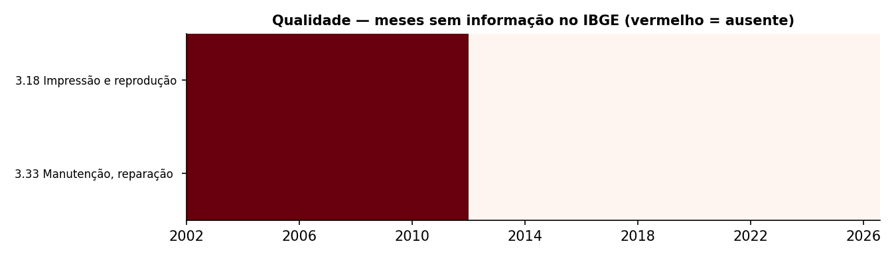

*Figura 1 — Meses sem informação no IBGE: apenas as divisões 3.18 e 3.33, antes de 2012.*

Ressalva importante: o índice não tem ajuste sazonal. A série industrial oscila fortemente entre meses por sazonalidade (Figura 2), o que torna inadequada a comparação mês a mês. Por isso toda a análise usa variação contra o mesmo mês do ano anterior, que elimina a sazonalidade, e médias de 12 meses.

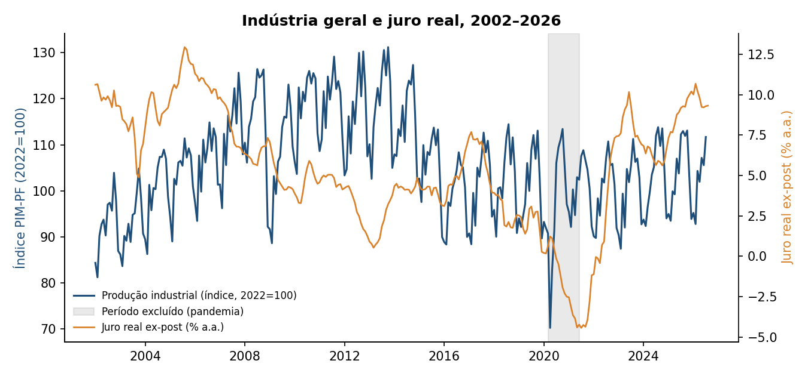

*Figura 2 — Produção industrial (índice sem ajuste sazonal) e juro real ex-post, 2002–2026.*

Amostra de análise. Para P2 a P5 usa-se janeiro/2013 a julho/2026, excluindo mar/2020–jun/2021: 147 meses, comum às 27 atividades. O corte em 2013 é o primeiro mês em que as duas divisões de série curta têm variação anual; a exclusão da pandemia evita que um único choque de +900% domine correlações e regressões.


### 5.2 P1 — Recuperação em relação a 2019

O agregado voltou: a indústria geral produz hoje (média dos últimos 12 meses) 3,0% acima da média de 2019, com queda máxima de 31% no fundo de 2020 e retorno sustentado ao patamar de 2019 em 4 meses. As extrativas estão 10,3% acima, e a indústria de transformação, 1,5% acima. A média, porém, esconde a divisão: das 24 divisões da transformação, 13 ainda estão abaixo de 2019 e 11 acima (Figura 3).

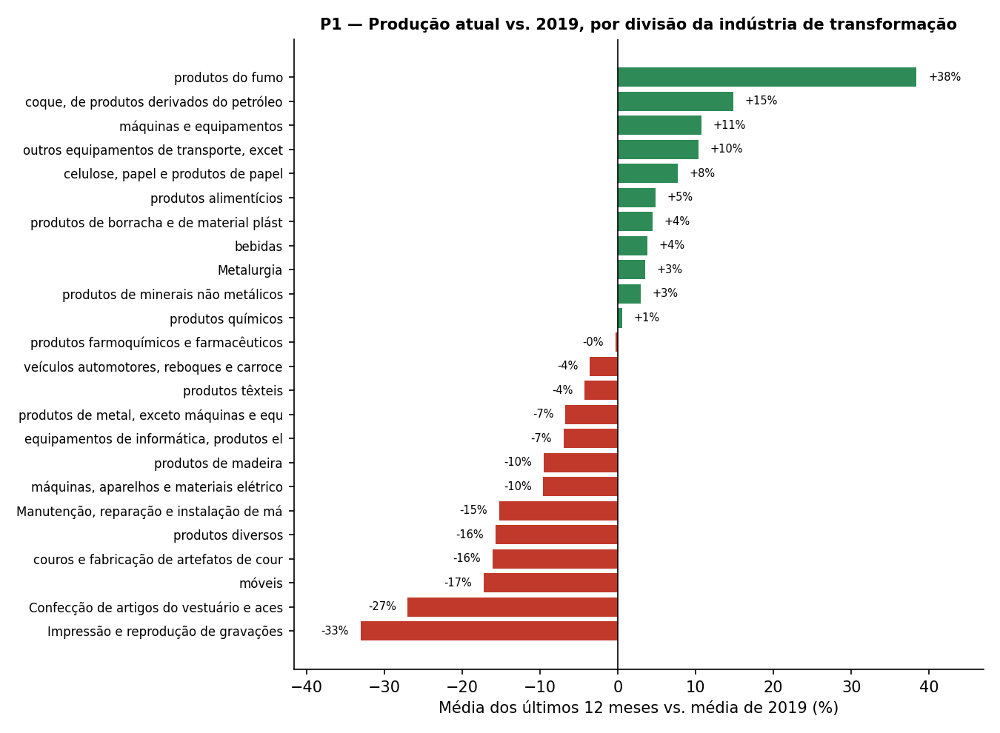

*Figura 3 — Produção atual vs. média de 2019 por divisão (P1).*

| Cód. | Divisão | Atual vs. 2019 | Queda máx. 2020 | Meses p/ recuperar |
|---|---|---|---|---|
| 3.18 | Impressão e reprodução de gravações | -33,1% | -66% | não recuperou |
| 3.14 | Confecção de artigos do vestuário e acessó | -27,0% | -67% | não recuperou |
| 3.31 | móveis | -17,3% | -61% | 4 |
| 3.15 | couros e fabricação de artefatos de couro, | -16,1% | -70% | 6 |
| 3.32 | produtos diversos | -15,7% | -49% | não recuperou |
| 3.17 | celulose, papel e produtos de papel | +7,7% | -6% | 4 |
| 3.30 | outros equipamentos de transporte, exceto  | +10,3% | -81% | 29 |
| 3.28 | máquinas e equipamentos | +10,7% | -41% | 5 |
| 3.19 | coque, de produtos derivados do petróleo e | +14,8% | -16% | 2 |
| 3.12 | produtos do fumo | +38,4% | 2% | 0 |

Resposta a P1. Os cinco piores casos são Impressão (−33%), Confecção (−27%), Móveis (−17%), Couro e calçados (−16%) e Produtos diversos (−16%): atividades intensivas em mão de obra e ligadas ao consumo das famílias e à impressão de mídia física. Os cinco melhores são Fumo (+38%), Derivados de petróleo (+15%), Máquinas e equipamentos (+11%), Outros equipamentos de transporte (+10%) e Celulose e papel (+8%), setores ligados a commodities, energia e bens de capital. Quatro divisões (Impressão, Confecção, Produtos diversos e Manutenção) nunca tiveram três meses seguidos acima da média de 2019 desde o choque. Veículos automotores levou 52 meses para recuperar o patamar, e Outros equipamentos de transporte, 29, embora ambos tenham a maior queda inicial (−92% e −81%). H3 confirmada: a recuperação foi desigual, e o agregado (+3,0%) esconde 13 divisões abaixo do nível pré-pandemia.

Cautela: comparar com a média de um único ano (2019) é uma escolha de base. 2019 foi um ano de crescimento fraco, então "acima de 2019" não significa "acima da tendência".


### 5.3 P2 — Sensibilidade ao juro real

Para cada uma das 27 atividades calculou-se a correlação entre o crescimento anual em t e o juro real em t−k. para k de 0 a 12 meses (Figura 4). O sinal esperado por H1 é negativo. Como a escolha do melhor k dentre 13 defasagens infla a chance de achar correlação por acaso. e as séries são altamente autocorrelacionadas. a significância foi avaliada por um teste de permutação: o juro real é deslocado circularmente (2.000 deslocamentos aleatórios) e compara-se a correlação mais negativa observada com a distribuição do mínimo sobre as 13 defasagens.

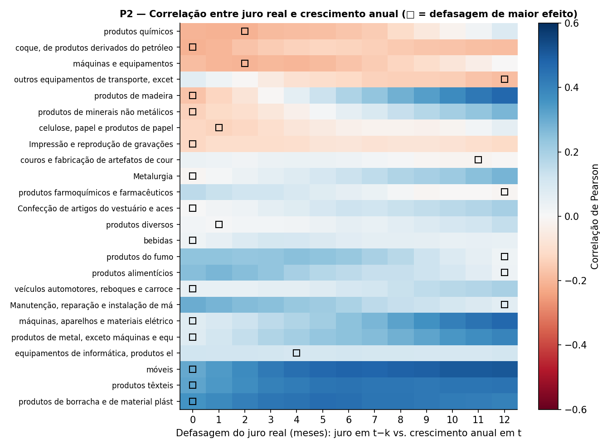

*Figura 4 — Correlação juro real × crescimento anual por defasagem, divisões da transformação (P2).*

| Atividade | Defasagem | Correlação | p (permutação) |
|---|---|---|---|
| 3.20 produtos químicos | 2 | -0,21 | 0,21 |
| 3.19 coque, de produtos derivados do petróleo e | 0 | -0,21 | 0,27 |
| 3.28 máquinas e equipamentos | 2 | -0,20 | 0,21 |
| 3.30 outros equipamentos de transporte, exceto  | 12 | -0,18 | 0,46 |
| 3.16 produtos de madeira | 0 | -0,17 | 0,39 |
| 3.23 produtos de minerais não metálicos | 0 | -0,14 | 0,58 |
| 1 Indústria geral | 0 | +0,19 | 0,91 |

Resposta a P2. Não há evidência de que o juro real explique o crescimento anual em nenhuma atividade: 0 das 27 séries têm p < 0,05 no teste de permutação. Só 11 das 27 correlações têm o sinal esperado, e a mais forte (Produtos químicos, defasagem de 2 meses) é de apenas −0,21, com p = 0,21. Para a indústria geral a correlação é positiva (+0,19), o oposto de H1. A defasagem mediana ótima é 0 mês, ou seja, não há padrão temporal identificável. H1 não é sustentada por estes dados.

Interpretação. Três explicações são plausíveis, e a análise não separa entre elas: (i) endogeneidade, porque o Banco Central sobe juros em ciclos de demanda aquecida e corta em recessões, o que gera correlação positiva espúria; (ii) o efeito do crédito passa por canais que o juro real ex-post não captura (spread, acesso a crédito, expectativas); (iii) amostra curta, de 13 anos, com poucos ciclos de juros. O resultado negativo é informativo: quem usar a Selic corrente para prever a produção setorial no curto prazo não terá respaldo nestes dados.


### 5.4 P3 — Câmbio, controlando o juro

Para cada atividade estimou-se por mínimos quadrados o crescimento anual contra o juro real defasado (no lag ótimo de P2) e a variação cambial de 12 meses, com erros-padrão robustos a autocorrelação e heterocedasticidade (Newey-West, 12 defasagens). A Figura 5 mostra os coeficientes com intervalos de 95%.

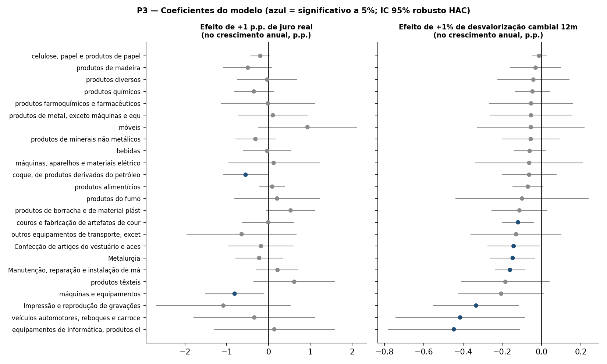

*Figura 5 — Coeficientes de juro real e de câmbio por divisão (P3).*

| Atividade | β câmbio (p.p. por 1% de desvalorização) | estatística t |
|---|---|---|
| 3.33 Manutenção, reparação e instalação de máqu | -0,16 | -4,18 |
| 3.18 Impressão e reprodução de gravações | -0,33 | -2,98 |
| 3.15 couros e fabricação de artefatos de couro, | -0,12 | -2,86 |
| 3.26 equipamentos de informática, produtos elet | -0,45 | -2,61 |
| 3.24 Metalurgia | -0,15 | -2,50 |
| 3.29 veículos automotores, reboques e carroceri | -0,41 | -2,47 |
| 1 Indústria geral | -0,12 | -2,42 |

Resposta a P3. O câmbio tem associação estatisticamente significativa em 9 das 27 atividades, e em todas o sinal é negativo: desvalorização do real acompanha crescimento anual menor. Para a indústria geral, cada 1% de desvalorização em 12 meses está associado a 0,12 p.p. a menos de crescimento anual (t = -2,4). Os maiores efeitos estão em Informática/eletrônicos, Veículos e Impressão, que dependem de insumos e componentes importados. Não há atividade com efeito positivo significativo, portanto a parte de H2 sobre exportadores não se confirma. A ressalva: o poder explicativo é baixo (R² mediano 0,06; máximo 0,21, em produtos de borracha e de material plástic), e as grandes desvalorizações do período (2015 e 2020) coincidem com recessões, de modo que o coeficiente pode refletir o ciclo econômico em vez do câmbio em si.


### 5.5 P4 — Volatilidade

A volatilidade foi medida pelo desvio-padrão do crescimento anual na amostra de análise. As divisões variam mais de quatro vezes entre si: Fumo (19,6 p.p.), Informática (17,0), Veículos (16,9) e Impressão (16,7) são as mais voláteis; Celulose e papel (4,4), Químicos (4,7) e Minerais não metálicos (5,6) são as mais estáveis. A indústria geral, por diversificação, tem 4,5 p.p., no nível da divisão mais estável.

Resposta a P4. A razão entre a divisão mais e a menos volátil é de 4,5 vezes. O pior crescimento anual de Veículos é −39% sem a pandemia e −92% com ela; o de Celulose e papel é −11% nos dois casos. A volatilidade tem correlação fraca com a sensibilidade ao juro (0,21), então o risco setorial vem sobretudo de fatores próprios da atividade, não da política monetária. Em termos de decisão, esta é a conclusão mais robusta do trabalho: o desvio-padrão setorial é estável e diretamente mensurável, ao contrário da sensibilidade ao juro.


### 5.6 P5 — Cenário de queda do juro real e discussão geral

O cenário aplica ao coeficiente de juro de cada atividade uma queda de 3 p.p. (de 9,3% a.a. em 2026/08, com Selic de 13,79% e IPCA 12m de 4,22%, para cerca de 6,3%, próximo à média histórica de 5,5%). O intervalo de 95% usa o erro-padrão robusto.

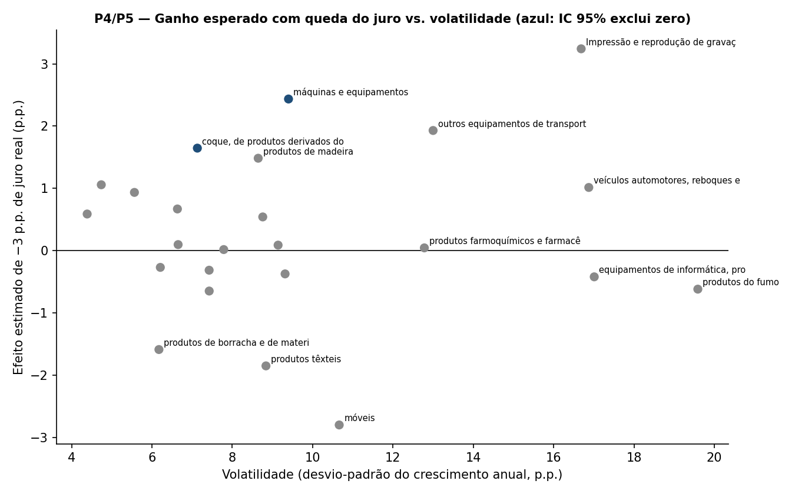

*Figura 6 — Efeito projetado de −3 p.p. de juro real vs. volatilidade (P4/P5).*

| Atividade | Efeito projetado (p.p.) | IC 95% | IC exclui zero? |
|---|---|---|---|
| 1 Indústria geral | -0,31 | [-1,31; 0,69] | não |
| 3 Indústrias de transformação | +0,12 | [-1,19; 1,44] | não |
| 3.28 máquinas e equipamentos | +2,44 | [0,31; 4,56] | sim |
| 3.19 coque, de produtos derivados do petróleo e | +1,65 | [0,01; 3,28] | sim |
| 3.18 Impressão e reprodução de gravações | +3,24 | [-1,60; 8,09] | não |
| 3.31 móveis | -2,80 | [-6,34; 0,74] | não |

Resposta a P5. Para a indústria geral o modelo projeta -0,31 p.p. de crescimento anual (IC 95%: -1,3 a +0,7), isto é, efeito indistinguível de zero e com sinal contrário ao esperado. Entre as 24 divisões, 15 têm efeito projetado positivo, mas em apenas 2 o intervalo exclui zero: Máquinas e equipamentos (+2,4 p.p.; IC +0,3 a +4,6; defasagem de 2 meses) e Derivados de petróleo (+1,7 p.p.; IC +0,01 a +3,3). Com 24 testes a 5%, esperam-se cerca de 1,2 falsos positivos por acaso, e nenhuma das duas sobrevive à correção do P2 (p = 0,21 e 0,27). Os efeitos de maior magnitude (Impressão +3,2 p.p.) têm IC que inclui grandes valores negativos. As extrativas têm efeito significativo com sinal invertido (−1,2 p.p.), consistente com o ciclo de commodities, e não com causalidade dos juros.

Discussão geral. Os resultados formam um quadro coerente, embora em parte negativo. (1) O diagnóstico descritivo é sólido e útil: o agregado industrial voltou a 2019, mas 13 de 24 divisões não, com um núcleo de setores de consumo e mídia ainda 16% a 33% abaixo. (2) A hipótese de que juros ditam a produção setorial não se sustentou: nenhuma série apresenta relação distinguível do acaso, e o agregado tem sinal oposto ao esperado, o que é compatível com endogeneidade da política monetária. (3) O câmbio tem associação negativa e consistente, mas de baixo poder explicativo. (4) A volatilidade setorial, que varia mais de quatro vezes, é a informação mais estável para decisão. Para um gestor, a implicação prática é que priorizar setores por sensibilidade ao corte de juros não tem base empírica neste modelo; Máquinas e equipamentos e Derivados de petróleo são hipóteses a investigar com dados adicionais (crédito, investimento, preços), não recomendações. O que os dados sustentam é a leitura de risco (P4) e a de recuperação (P1).


## 6. Ética, licenciamento e proteção de dados

- Licença dos dados. Ambas as fontes são estatísticas públicas divulgadas como dados abertos: IBGE (SIDRA) e Banco Central do Brasil (SGS). Exigem citação da fonte. A licença específica de cada conjunto não foi verificada automaticamente nesta execução, e deve ser conferida em sidra.ibge.gov.br e dadosabertos.bcb.gov.br antes de qualquer reutilização comercial. Por serem séries agregadas de tamanho pequeno (cerca de 1,7 MB), os arquivos brutos foram versionados para garantir reprodutibilidade; o script de coleta também está publicado.
- Dados pessoais (LGPD). Não se aplica: as bases são agregados nacionais mensais, sem identificadores de pessoas ou empresas.
- Dados corporativos. Não se aplica: nenhum dado de empresa foi utilizado.
- Coleta automatizada. Foram usadas apenas APIs oficiais, sem scraping, com pausa entre tentativas.
- Código. O código do repositório está sob a licença MIT (arquivo LICENSE).


## 7. Autoavaliação

Objetivos atingidos. As perguntas P1, P3 e P4 foram respondidas com evidência. P2 e P5 foram respondidas, mas com resultado negativo/inconclusivo: os dados não sustentam relação entre juro real e produção setorial. O resultado é legítimo e foi reportado como tal, sem remoção de perguntas nem busca de especificações até achar significância.

Perguntas sugeridas:

- Quais perguntas foram respondidas e quais não? P1, P3 e P4 foram respondidas de forma conclusiva. P2 e P5 tiveram resposta negativa: não há relação detectável entre juro real e crescimento setorial. A causa provável é a combinação de endogeneidade da política monetária, amostra curta e um regressor (juro real ex-post) que não capta o canal de crédito.
- Que limitações dos dados condicionaram os resultados? Índice sem ajuste sazonal (obrigou o uso de variação anual, que perde informação de curto prazo); apenas 13 anos comparáveis; efeito da pandemia, que exigiu excluir 16 meses; ausência de controles (crédito, renda, demanda externa, preços de commodities); e nível nacional agregado, sem heterogeneidade regional. O câmbio e o juro são medidos por séries únicas para todas as atividades, embora a exposição varie por setor (exportador, importador).
- Que decisões técnicas tomaria de outra forma? Testaria o pipeline no Databricks desde o primeiro dia, em vez de validá-lo localmente antes. Só na execução real apareceu que o Free Edition não acessa a internet, o que obrigou a separar a coleta (local) da persistência (nuvem) e adaptar o notebook 01; descobrir isso cedo teria orientado o desenho da coleta. Usaria a série com ajuste sazonal que o IBGE também divulga e um modelo em primeiras diferenças ou VAR, mais adequado a séries persistentes. Incluiria ao menos uma variável de crédito (concessões do BCB) e uma de demanda externa.
- Que extensões transformariam o MVP em solução de uso contínuo? Agendamento mensal do job (Databricks Workflows) alinhado à divulgação da PIM-PF; carga incremental em vez de recarga completa; testes automatizados de qualidade (as verificações da Seção 5.1 viram expectativas de dados); painel de monitoramento; inclusão de PIM regional e de indicadores de crédito; e monitoramento da estabilidade das estimativas ao longo do tempo.

Trabalhos futuros. Estimar o efeito do juro com identificação mais forte (choques monetários de alta frequência, ou variáveis instrumentais); incluir a pesquisa regional (PIM-PF regional) e a de comércio exterior para separar exportadores de importadores no P3; estender a análise a serviços e comércio.


## 8. Reprodutibilidade

- Local: python scripts/coleta.py → python scripts/etl.py → python scripts/analise.py → python scripts/gerar_catalogo.py → python scripts/gerar_relatorio.py. Dependências em requirements.txt. Semente aleatória fixa (42).
- Databricks: criar uma Git folder com o repositório e executar notebooks/01, 02 e 03 em ordem. Os notebooks usam catalog workspace e schema industria_juros. O Free Edition não tem acesso à internet: o notebook 01 tenta a API e, se falhar, usa o bronze versionado em data/raw.
- Repositório: https://github.com/iwanolucas/MVP-Industria-Juros
- Fontes: IBGE/SIDRA tabela 8888 (PIM-PF); BCB/SGS séries 4189, 433, 13522 e 3698.
